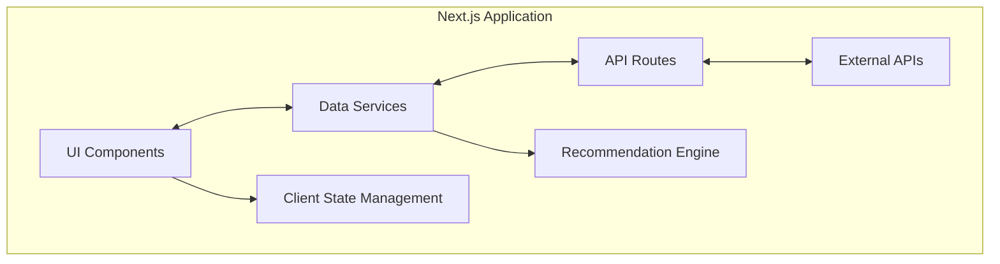
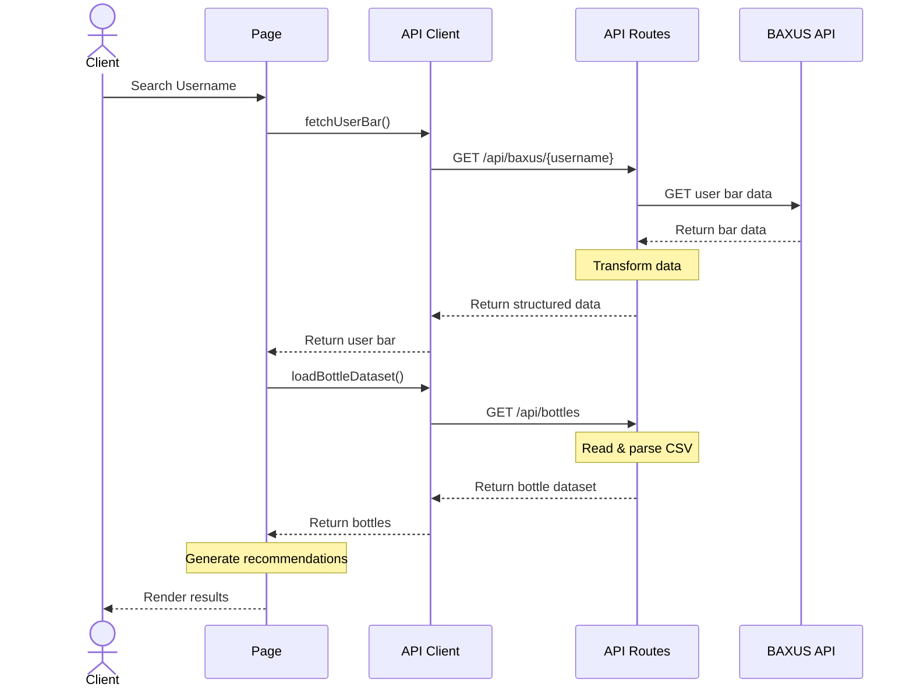
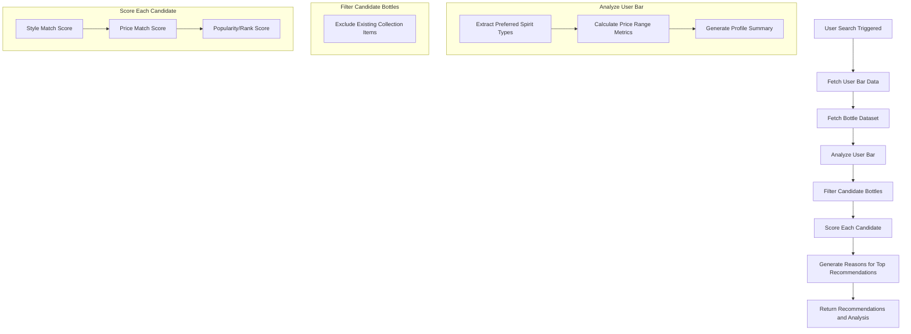
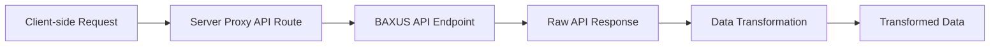
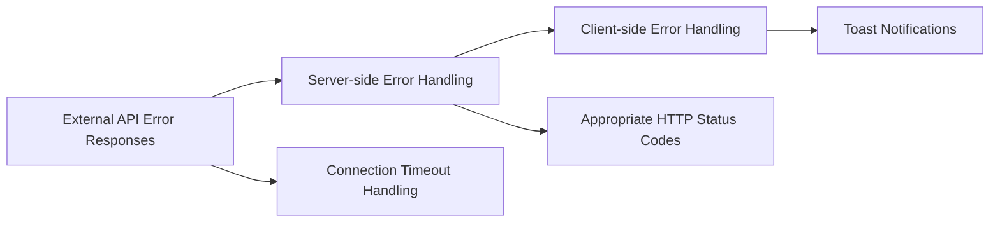

# BOB AI Architecture

This document outlines the architecture of the BOB AI whisky recommendation agent, including component structure, data flow, and key processes.

## Table of Contents

1. [System Overview](#system-overview)
2. [Component Architecture](#component-architecture)
3. [Data Flow](#data-flow)
4. [Recommendation Engine](#recommendation-engine)
5. [API Integration](#api-integration)
6. [Error Handling](#error-handling)

## System Overview

BOB AI is a Next.js application that analyzes user whisky collections from the BAXUS platform and provides personalized bottle recommendations. The system integrates with the BAXUS API to fetch user data and uses a sophisticated recommendation algorithm to suggest new bottles based on user preferences.

### High-Level Architecture



## Component Architecture

The application is structured with clean separation of concerns:

```
src/
│
├── app/                    # Next.js application pages
│   ├── api/                # API routes for data fetching
│   │   ├── baxus/         # Proxy for BAXUS API 
│   │   └── bottles/       # Bottle dataset API
│   ├── page.tsx           # Main application page
│   └── layout.tsx         # Application layout with toast provider
│
├── components/            # React components
│   ├── user-search.tsx    # Username search component
│   ├── profile-summary.tsx # User profile analysis component
│   ├── bottle-card.tsx    # Bottle display component
│   ├── recommendations-section.tsx # Recommendations container
│   └── ui/                # shadcn UI components
│
└── lib/                   # Utilities and core logic
    ├── api.ts             # API utilities for fetching data
    ├── recommendation-engine.ts # Recommendation algorithm
    └── utils.ts           # General utility functions
```

## Data Flow

### Sequence Diagram: User Search and Recommendation Process



## Recommendation Engine

### Flow Diagram: Recommendation Process



### Key Algorithm: Bottle Scoring

The recommendation engine uses a multi-factor scoring algorithm to rank potential bottle recommendations:

```javascript
function calculateBottleScore(bottle, userBar, analysis) {
  let score = 50; // Base score
  
  // Style match (up to +20 points)
  if (analysis.preferredStyles.includes(bottle.spirit_type)) {
    const styleIndex = analysis.preferredStyles.indexOf(bottle.spirit_type);
    score += 20 - (styleIndex * 5); // More points for top preferences
  }
  
  // Price match (up to +15 points)
  const bottlePrice = bottle.avg_msrp || bottle.fair_price || bottle.shelf_price || 0;
  if (bottlePrice >= analysis.priceRanges.min * 0.8 && 
      bottlePrice <= analysis.priceRanges.max * 1.2) {
    score += 15;
  }
  
  // Popularity/rating boost (up to +10 points)
  if (bottle.total_score) {
    score += Math.min(10, bottle.total_score / 10000);
  }
  
  // Ranking boost (up to +10 points)
  if (bottle.ranking && bottle.ranking <= 100) {
    score += Math.max(0, 10 - (bottle.ranking / 10));
  }
  
  return score; // Maximum possible score: 85
}
```

## API Integration

### BAXUS API Integration Process



The application uses a server-side proxy to communicate with the BAXUS API, which helps address CORS issues and allows for data transformation before sending to the client.

### Data Transformation

The BAXUS API returns an array of bar items, each containing a product object. Our transformation process:

1. Extracts relevant product information
2. Converts proof to ABV where needed
3. Standardizes price information
4. Structures data into the expected UserBar format

```javascript
// Transform BAXUS API data
const bottles = baxusData.map(item => {
  const product = item.product;
  return {
    id: product.id,
    name: product.name,
    spirit_type: product.spirit || '',
    abv: product.proof ? product.proof / 2 : undefined,
    proof: product.proof,
    avg_msrp: product.average_msrp || product.fair_price || product.shelf_price,
    fair_price: product.fair_price,
    shelf_price: product.shelf_price,
    total_score: product.popularity,
    image_url: product.image_url,
    brand_id: product.brand_id,
    fill_percentage: item.fill_percentage,
  };
});

// Create standardized UserBar object
const userBar = {
  username: username,
  bottles: bottles,
  wishlist: [] // API doesn't provide wishlist data
};
```

## Error Handling

The application implements a comprehensive error handling strategy:



### Error Handling Flow

1. **External API errors**: 
   - Connection timeouts (5 second limit)
   - Invalid response status codes
   - Malformed data

2. **Server-side error handling**:
   - Proper HTTP status codes based on error type
   - Detailed error messages
   - Logging for debugging

3. **Client-side error handling**:
   - Toast notifications with user-friendly messages
   - State management to handle loading/error states
   - Input validation

### Error Response Structure

```javascript
// Server-side error response
return NextResponse.json(
  { error: 'Specific error message' },
  { status: statusCode }
);

// Client-side error handling
try {
  // API calls
} catch (err) {
  const errorMessage = err instanceof Error 
    ? err.message 
    : 'Failed to connect to BAXUS API';
  
  toast.error('Connection Error', {
    description: errorMessage,
    duration: 5000,
  });
}
``` 