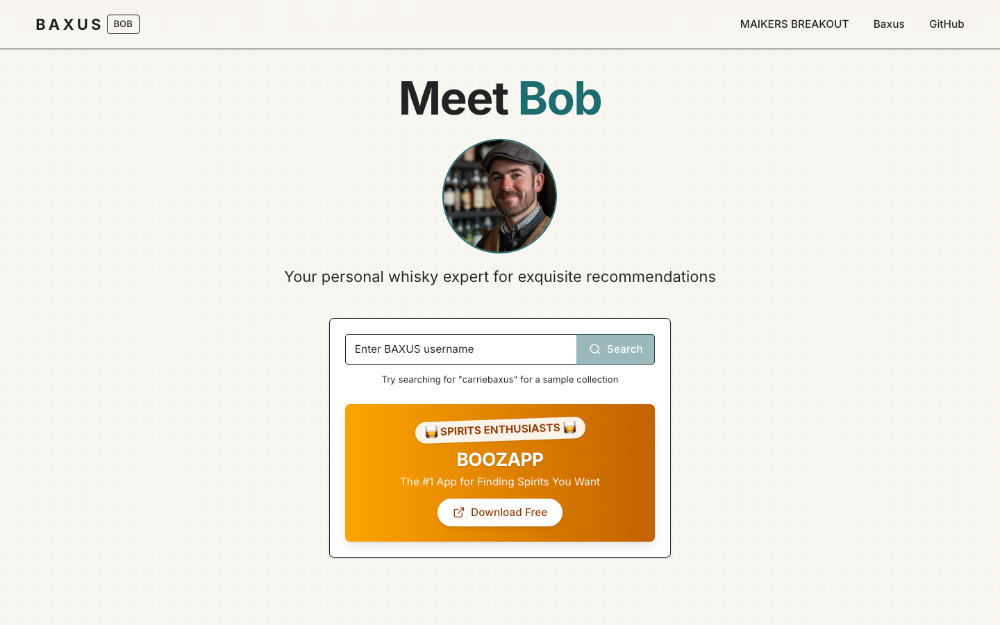

# 🥃 Bob AI - BAXUS Whisky Recommendation Agent

Bob is an AI agent designed for the BAXUS ecosystem that analyzes users' virtual whisky bars to provide personalized bottle recommendations for their wishlists.

## 🚀 Live Prototype

Try the Bob AI prototype here: [Bob AI Prototype](https://bob-ai.baxus.co)

## 📺 Demo Video

Watch a demonstration of Bob providing personalized recommendations based on real user collections:

<div align="center">
    
</div>

> **Note:** Replace `DEMO_VIDEO_ID` with the actual YouTube video ID when the demo is published.

## Features

- 🔍 **Collection Analysis**: Analyzes existing bar data to identify patterns in user preferences (styles, price points, etc.)
- 🧠 **Smart Recommendations**: Suggests new bottles based on your collection profile
- 💰 **Price-Aware**: Provides recommendations within similar price ranges to match your spending habits
- 🌟 **Complementary Selections**: Recommends bottles that both match and diversify your collection

## Tech Stack

- 🔄 Next.js 15 - React framework
- 🎨 Tailwind CSS - Styling
- 🧩 shadcn/ui - UI components
- 🤖 Langchain - AI recommendation engine
- 📊 CSV parsing - For bottle dataset management

## Getting Started

### Prerequisites

- Node.js 18+ (or as required by Next.js 15)
- pnpm (preferred package manager)

### Installation

1. Clone the repository:
   ```bash
   git clone https://github.com/MaikersHQ/baxus-ai-agent-bob.git
   cd baxus-ai-agent-bob
   ```

2. Install dependencies:
   ```bash
   pnpm install
   ```

3. Run the development server:
   ```bash
   pnpm dev
   ```

4. Open [http://localhost:3000](http://localhost:3000) to view the app

## Usage

1. Enter a valid BAXUS username in the search box
2. Bob will analyze the user's bar collection
3. View the profile analysis showing preferences and patterns
4. Browse personalized bottle recommendations with explanations

## API Integration

Bob integrates with the BAXUS API to fetch user bar data:

```
GET http://services.baxus.co/api/bar/user/{username}
```

## Data Sources

The recommendation engine utilizes a dataset of 501 bottles for making personalized suggestions. This dataset is loaded from a CSV file included in the project at `data/501 Bottle Dataset - Sheet1.csv`.

## Project Structure

```
├── src/
│   ├── app/              # Next.js app directory
│   ├── components/       # React components
│   │   ├── bottle-card.tsx
│   │   ├── profile-summary.tsx
│   │   ├── recommendations-section.tsx
│   │   ├── user-search.tsx
│   │   └── ui/           # shadcn UI components
│   ├── lib/              # Utility functions and libraries
│   │   ├── api.ts        # API integration
│   │   ├── recommendation-engine.ts # AI recommendation logic
│   │   └── utils.ts
├── data/                 # Dataset files
│   └── 501 Bottle Dataset - Sheet1.csv  # Main bottle dataset
├── public/               # Static files
└── ...config files
```

## Acknowledgments

- BAXUS team for providing the API and dataset
- shadcn for the beautiful UI components
- Vercel for hosting and deployment solutions
